# Week 13: ELK Stack Project
# Raymond Yeung

&nbsp;

## Automated ELK Stack Deployment

&nbsp;

The files in this repository were used to configure the network depicted below:

&nbsp;

#### Phase 1: Week 12 (Initial Network) - Deployment of DVWA to the Web Servers:
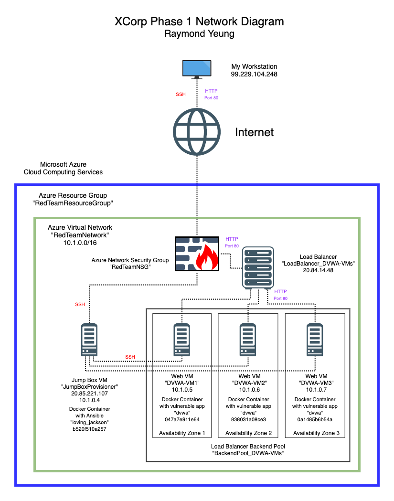

&nbsp;

#### Phase 2: Week 13 (Final Network) - Deployment of ELK Stack to the ELK Server:
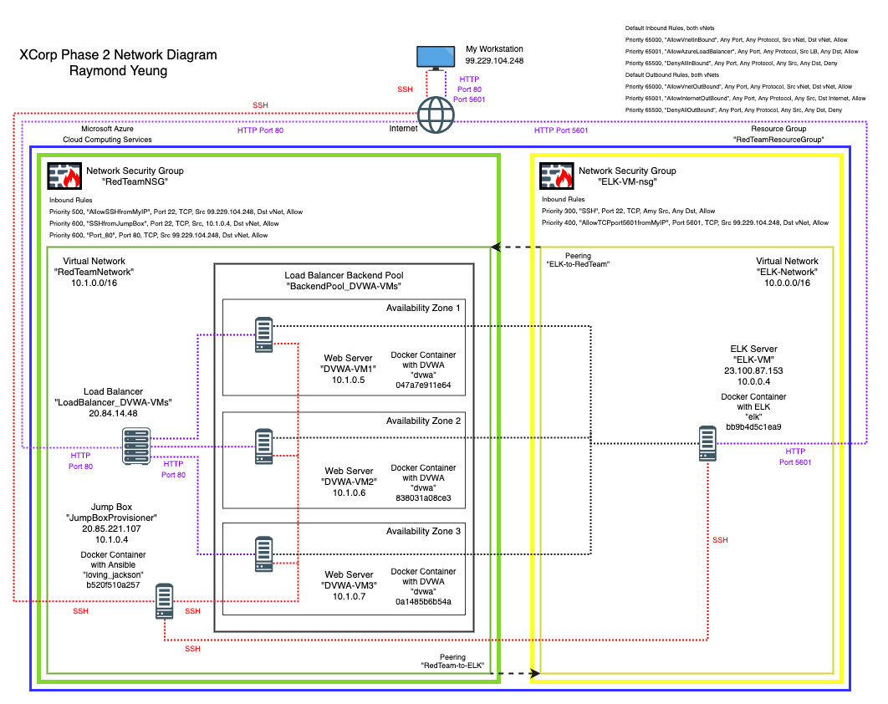

&nbsp;

These Ansible Playbook yaml files have been tested and used to generate a live ELK deployment on Azure. They can be used to either recreate the entire deployment pictured above, or alternatively, select portions may be used to install only certain pieces of it, such as Filebeat or Metricbeat:

  - [install-dvwa.yml : Install Docker dvwa Container dvwa on a Web Server VM](Ansible/install-dvwa.yml)

  - [install-elk.yml : Install Docker elk Container on the ELK Server VM](Ansible/install-elk.yml)

  - [install-filebeat-file.yml : Install Filebeat on a Web Server VM](Ansible/install-filebeat.yml)

  - [install-metricbeat.yml : Install Metricbeat on a Web Server VM](Ansible/install-metricbeat.yml)

&nbsp;

This document contains the following details:
- Description of the Topology
- Access Policies
- ELK Configuration
- Target Machines & Beats
- Using the Ansible Playbook to deploy ELK Stack on the ELK Server

&nbsp;

### Description of the Topology

The main purpose of this network is to expose a load-balanced and monitored instance of DVWA, the Damn Vulnerable Web Application.

The entire network is made up of 5 Virtual Machines (VMs) created on Microsoft Azure Cloud Computing Services:

| Name of VM | Purpose | Function |
| :----------------- | :--------- | :------------------------------ |
| JumpBoxProvisioner | Jump Box   | Provision & Configure other VMs |
| DVWA-VM1           | Web Server | Run DVWA, Filebeat & Metricbeat |
| DVWA-VM2           | Web Server | Run DVWA, Filebeat & Metricbeat |
| DVWA-VM3           | Web Server | Run DVWA, Filebeat & Metricbeat |
| ELK-VM             | ELK Server | Run ELK Stack                   |

The Jump Box allows the system administrator to remotely access the network via the Internet using SSH. It has a Docker Container with Ansible installed. From here, the system administrator can access the other 4 VMs within the network using SSH, so as to install and configure other Docker Containers onto these 4 VMs. The advantage of a jump box is that it can use provisioning software (in this case, Ansible) to configure many machines in the same way, at the same time, thereby simplifying these tasks and making the implementation and modification of services on a network more efficient.

Each of 3 Web Servers will run the DVWA. They are not directly exposed to the Internet, but will receive traffic from a Load Balancer that will distribute Internet traffic to them. Load balancing ensures that the application (in this case, the DVWA) will be highly resilient and redundant by distributing traffic load to multiple Web Servers, in addition to restricting unauthorized access or excessive traffic to the network. If one Web Server goes down, the Load Balancer will distribute traffic to the other two Web Servers which are still operational. Depending on configuration, load balancers can offer other security, such as protecting against DDoS attack by detecting and dropping excessive traffic, using a Web Application Firewall to protect the website from emerging threats, and can also autheticate user access by requesting a username and password before granting access.

Integrating an ELK Server allows users to easily monitor the vulnerable Web Servers for changes to the file system and to the operating system:
- Filebeat collects data about the file system from the Web Servers that are running the DVWA which can then be sent to the ELK Server.
- Metricbeat collects machine metrics from these web VMs that are running the DVWA which can then be sent to the ELK Server.
- The ELK Stack on the ELK Server uses Logstash as a data processing pipeline to send data collected from Filebeat and Metricbeat to Elasticsearch which is a search and analytics engine, and then Kibana can be used to visualize the data with charts, graphs and tables.

The configuration details of each machine is shown below:

| Name of VM | IP Address | Subnet | Virtual Network | Operating System |
| :----------------- | :--------- | :-----------| :------------- | :------------------ |
| JumpBoxProvisioner | 10.1.0.4   | 10.1.0.0/16 | RedTeamNetwork | Linux (ubuntu 20.04) |
| DVWA-VM1           | 10.1.0.5   | 10.1.0.0/16 | RedTeamNetwork | Linux (ubuntu 20.04) |
| DVWA-VM2           | 10.1.0.6   | 10.1.0.0/16 | RedTeamNetwork | Linux (ubuntu 20.04) |
| DVWA-VM3           | 10.1.0.7   | 10.1.0.0/16 | RedTeamNetwork | Linux (ubuntu 20.04) |
| ELK-VM             | 10.0.0.4   | 10.0.0.0/16 | ELK-Network | Linux (ubuntu 20.04) |

**NOTE:** These 5 VMs are in 2 separate vNets. The Jump Box and the 3 Web Servers are in RedTeamNetwork (which is in Region: East US), and the ELK Server is in ELK-Network (which is in Region: Central US). Peering Connection allows traffic to the between these 2 vNets.

&nbsp;

### Access Policies

All 3 Web Servers (DVWA-VM1 , DVWA-VM2 , DVWA-VM3) on the internal network are not directly exposed to the public Internet. They receive traffic distributed to them by the Load Balancer.

Only the Jump Box (JumpBoxProvisioner), the ELK Server (ELK-VM) and the Load Balancer (LoadBalancer_DVWA-VMs) can accept connections from the Internet. Access to these machines are only allowed from the following external IP address:
- 99.229.104.248

&nbsp;

All machines within the network can be accessed by SSH from the Jump Box, which has a Docker Container installed for Ansible, which will be used to provision and configure the other VMs:
- The internal IP address of the Jump Box is 10.1.0.4
- The internal IP address of the ELK Server is 10.0.0.4
 The ELK Server can be configured by the Jump Box.
- The internal IP addresses of the Web Servers are 10.1.0.5 , 10.1.0.6 , 10.1.0.7
 The Web Servers can be configured by the Jump Box.

&nbsp;

A summary of the access policies in place can be found in the table below:

| Name | Publicly Accessible | Allowed External IP Addresses |
| :-------------------- | :------------------ | :------------- |
| JumpBoxProvisioner    | Yes (20.85.221.107) | 99.229.104.248 |
| LoadBalancer_DVWA-VMs | Yes (20.84.14.48)   | 99.229.104.248 |
| DVWA-VM1              | No                  |                |
| DVWA-VM2              | No                  |                |
| DVWA-VM3              | No                  |                |
| ELK-VM                | Yes (23.100.87.153) | 99.229.104.248 |

&nbsp;

| Name | Allowed Internal IP Addresses |
| :----------------- | :---------------------------------------- |
| JumpBoxProvisioner | 10.1.0.5 / 10.1.0.6 / 10.1.0.7 / 10.0.0.4 |
| DVWA-VM1           | 10.1.0.4 / 10.0.0.4                       |
| DVWA-VM2           | 10.1.0.4 / 10.0.0.4                       |
| DVWA-VM3           | 10.1.0.4 / 10.0.0.4                       |
| ELK-VM             | 10.1.0.4 / 10.1.0.5 / 10.1.0.6 / 10.1.0.7 |

&nbsp;

### ELK Configuration

Ansible was used to automate configuration of the ELK machine. No configuration was performed manually, which is advantageous because Ansible can deploy a Docker Container with an ELK Stack onto the ELK Server. This container can now be tested. If required, it can be stopped or destroyed. If desired, more ELK Servers can be connected and Ansible can deploy the same ELK Stack Docker Container onto these newly connected servers. This simplifies deployment and undeployment across the whole network as new VMs are added.

The playbook implements the following tasks:
- Install `apt` package `docker.io`
- Install `apt` package `python3-pip`
- Install `pip` package `docker`
- Configures target VM to use more memory
- Download and Launch the Docker ELK Container
  - Download and install  `sebp/elk:761`
  - Configure the Docker ELK Container to start with specified port mappings
  - Start the Docker ELK Container
- Enables the Docker ELK Container service on boot, whenever the ELK Server restarts

&nbsp;

The following screenshot displays the result of running `sudo docker ps` or running
`sudo docker container list -a` after successfully configuring the ELK instance on the ELK Server:

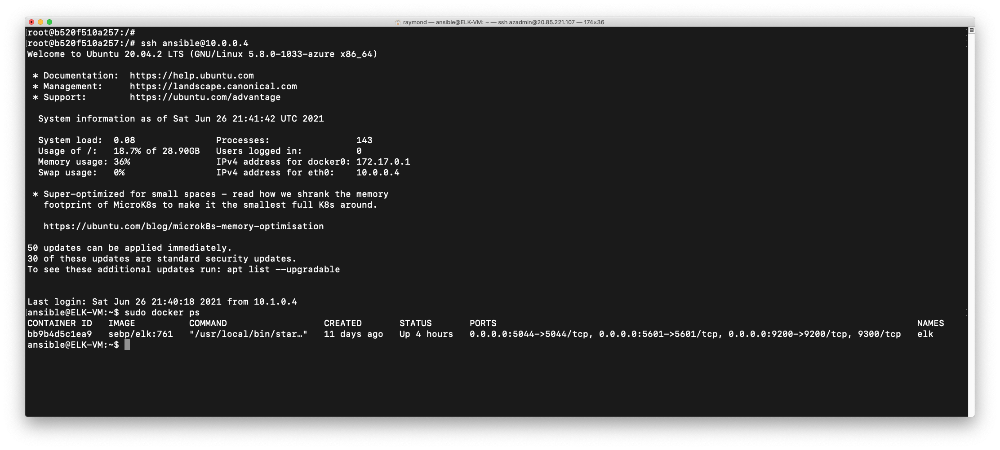

&nbsp;

Likewise, running this command on the DVWA instance on each of the 3 Web Servers will display these screenshots:

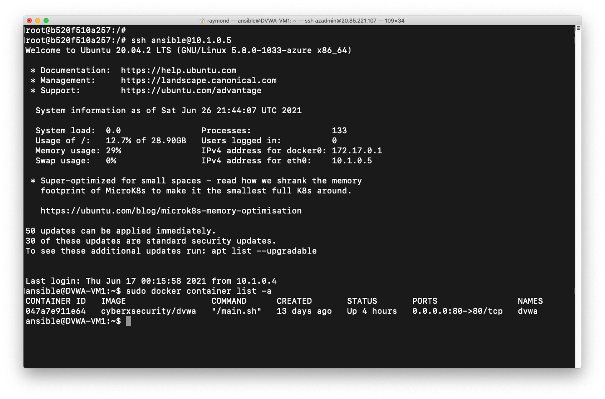


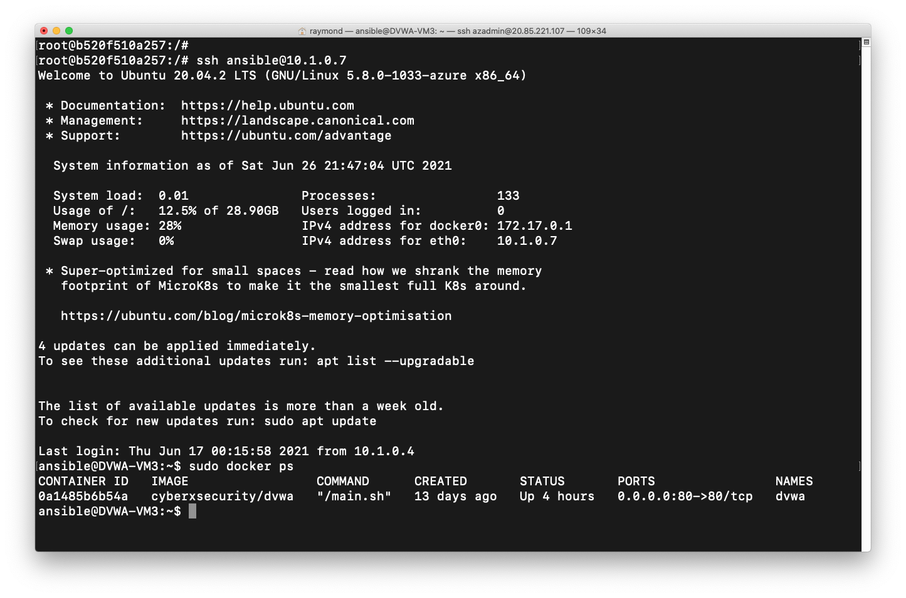

&nbsp;

**NOTE:** It is assumed that DVWA Configuration on each of the 3 Web Servers have already been done in **Phase 1** in **Week 12**, and therefore this is not discussed in detail on this README.

&nbsp;

### Target Machines & Beats

This ELK Server (ELK-VM) at 10.0.0.4 is configured to monitor the following 3 Web Servers:
- DVWA-VM1 at 10.1.0.5
- DVWA-VM2 at 10.1.0.6
- DVWA-VM3 at 10.1.0.7

&nbsp;

We have installed the following Beats on each of the above 3 Web Servers:
- Filebeat
- Metricbeat

&nbsp;

These Beats allow us to collect the following information from each machine:

- Filebeat collects data on
  - Syslog
  - Sudo commands
  - SSH logins
  - New users and groups

For example, Syslog collects logs of which processes are running on which hosts.

- Metricbeat collects data on
  - CPU usage
  - Memory usage
  - Network IO

For example, Memory usage collects data on how much memory (as a percentage, and in actual MB) the Docker Containers are using.

&nbsp;

Screenshots of Kibana displaying Filebeat and Metricbeat are shown here:

&nbsp;

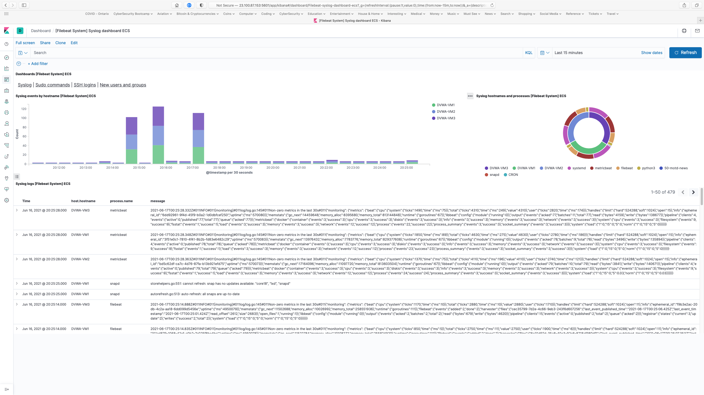

&nbsp;

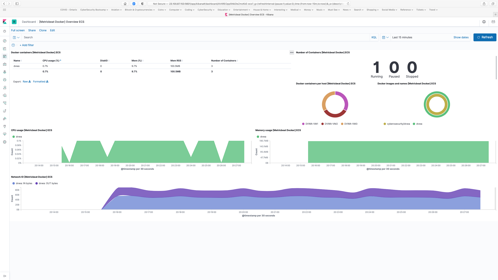

&nbsp;

### Using the Ansible Playbook to deploy ELK Stack on the ELK Server

In order to use the playbook, onel needs to have an Ansible control node already configured. Assuming such a control node has already been provisioned on the Jump Box in **Phase 1** in **Week 12**... 

SSH from your own workstation at 99.229.104.248 into the Jump Box at 20.85.221.107:
**ssh azadmin@20.85.221.107**

Check that the Docker Ansible Container is installed (in this case, the name is `loving_jackson`):
**sudo docker container list -a**`

Start and Attach the Container:
**sudo docker start loving_jackson**
**sudo docker attach loving_jackson**

&nbsp;

Screenshot of the Command Line:

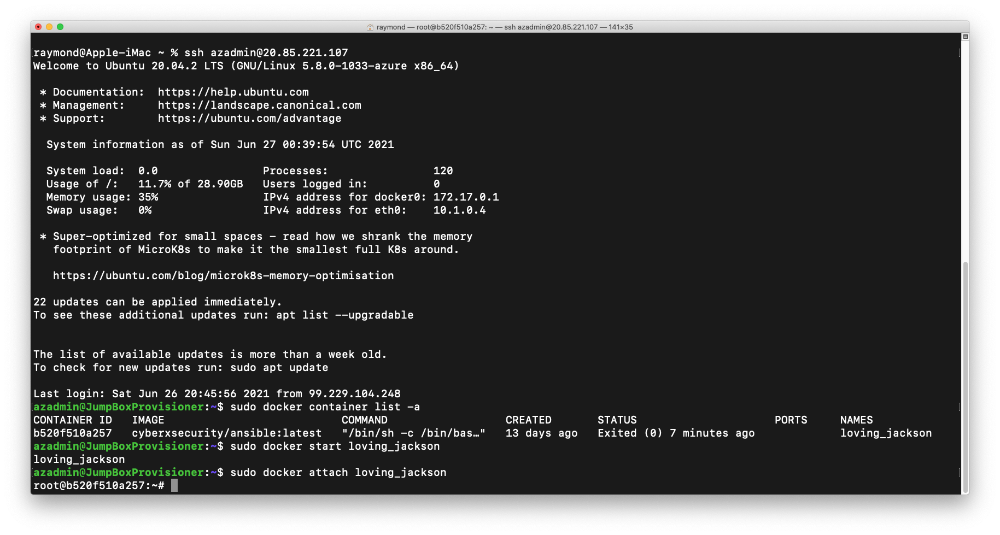

&nbsp;

Update the Ansible `hosts` file:
**nano /etc/ansible/hosts**

&nbsp;

The 3 Web Servers in the `[webservers]` *group* should already be there from the **Phase 1** setup in **Week 12**:
```
[webservers]
 10.0.0.4 ansible_python_interpreter=/usr/bin/python3
 10.0.0.5 ansible_python_interpreter=/usr/bin/python3
 10.0.0.6 ansible_python_interpreter=/usr/bin/python3
```

&nbsp;

Add the ELK Server to a new `[elk]` *group*, so that Ansible can discover and connect to it during this **Phase 2** setup in **Week 13**:
```
 [elk]
 10.1.0.4 ansible_python_interpreter=/usr/bin/python3
```

&nbsp;

The Ansible `hosts` file should look like this:

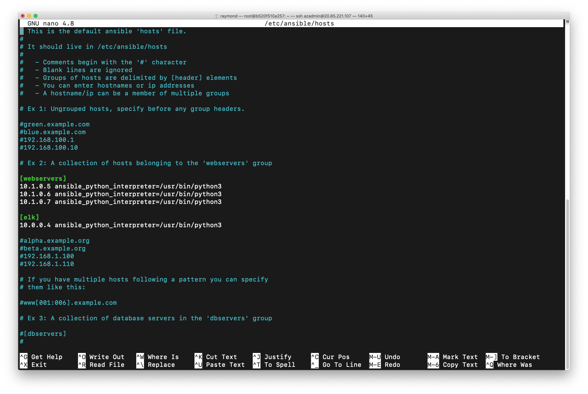

&nbsp;

Run the `install-elk.yml` playbook, which should have been saved in the `/etc/ansible/roles/` directory:
**ansible-playbook /etc/ansible/roles/install-elk.yml**

&nbsp;

Screenshot of `install-elk.yml` as seen on `nano`:

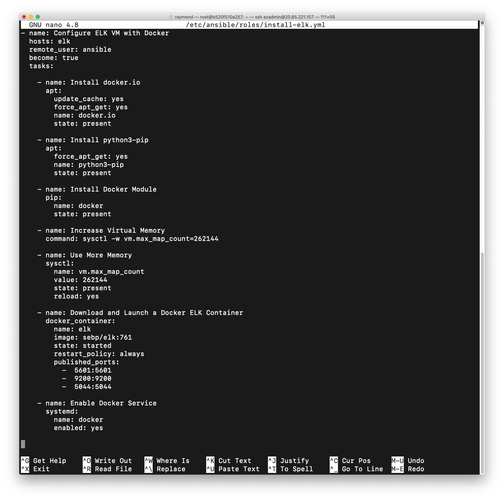

Screenshot of how to find `install-elk.yml` and how to run it:

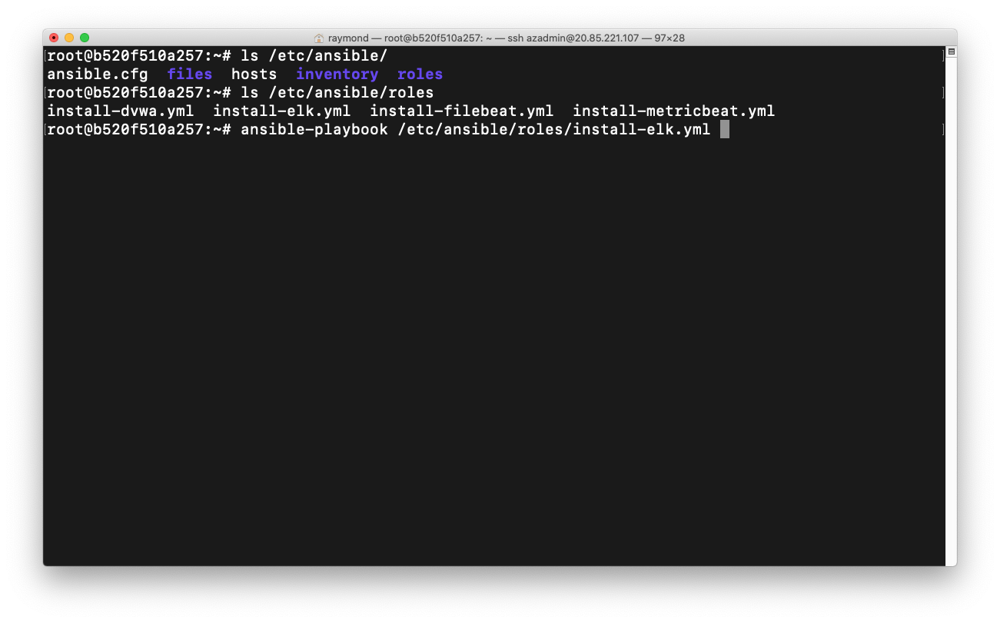

**NOTE:** Ansible will run the playbook on the ELK Server because in the `install-elk.yml` file, it is specified: `hosts: elk` which means that the machine(s) should be the one / those in the `elk` *group* that was defined in the Ansible `hosts` file.

&nbsp;

A web browser can be used from IP Address `99.229.104.248` to connect to Kibana on the ELK Server at IP Address `23.100.87.153` on port `5601` to check that it is working:

`http://23.100.97.153:5601/app/kibana`

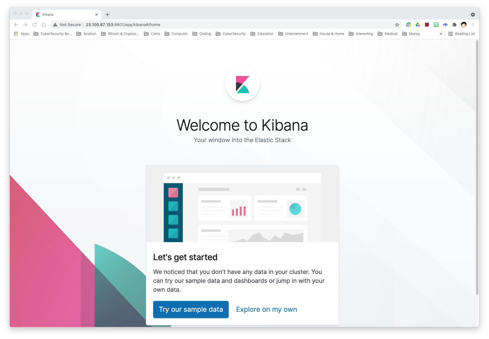

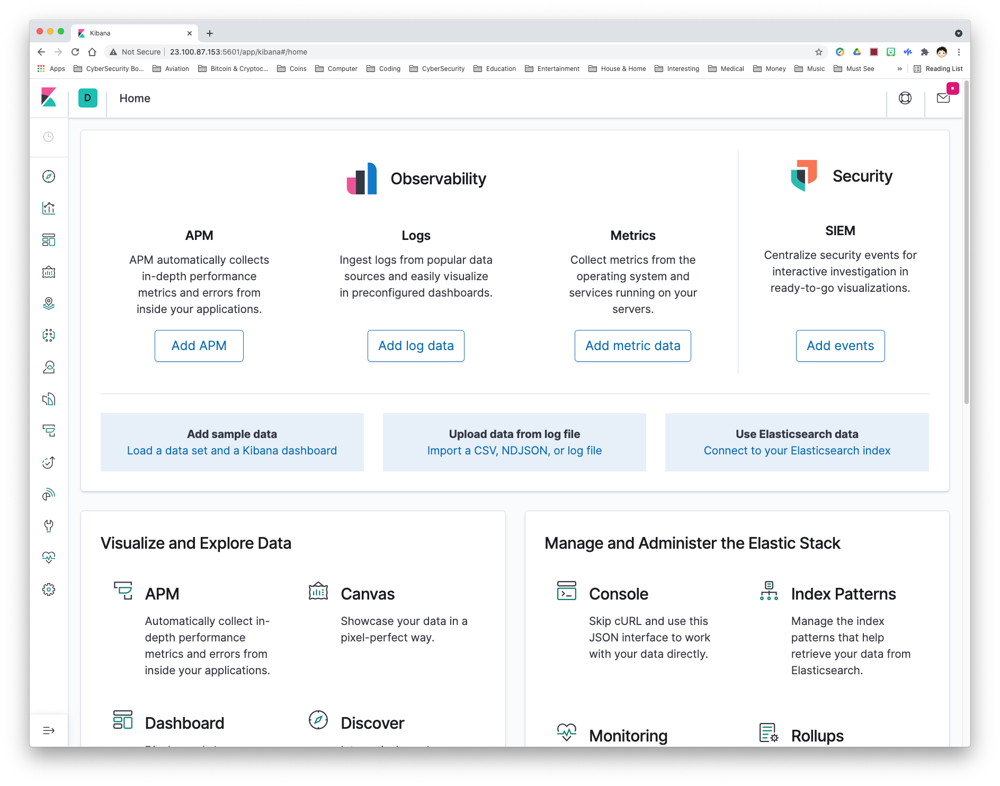


